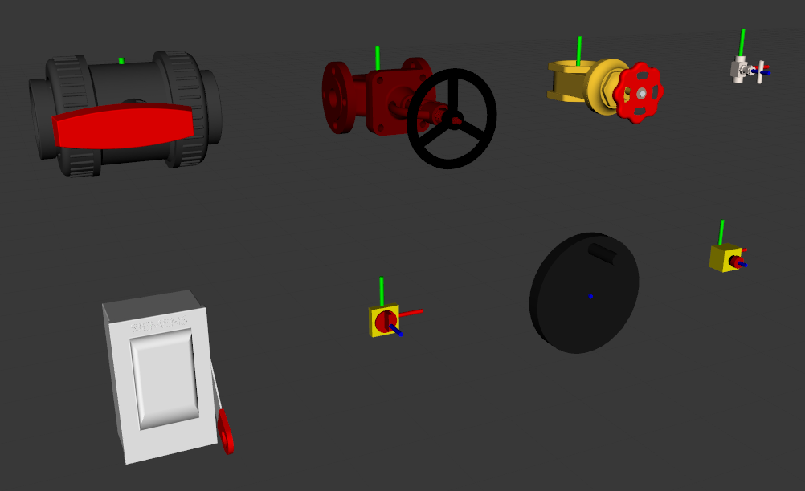
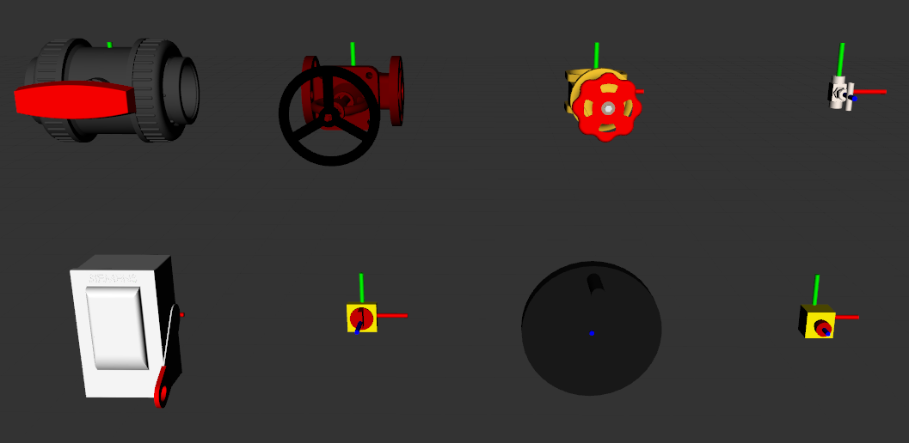

# manipulation_playground





## Introduction

A set of articulated devices implemented as 'robots' in simulation. Static and actuated models for visualization and simulation in RViz and Gazebo.

The devices have the same affordances as their physical counterparts, and can optionally simulate changes in reactive force/torque in response to being interacted with (representing behaviors such as becoming stiffer as they are tightened). The switches can also be switched on/off.

For example, the e-stop button is activated by being sufficiently depressed, and is released by being sufficiently twisted anticlockwise. However, it will resist both actions, applying more reactive force/torque as it is depressed or twisted further. This behavior closely resembles that of a real e-stop button.

Currently implemented (left to right, top to bottom):
- Ball Valve (based on [Van de Lande 6.20.110 Ball Valve](https://www.vandelande.com/en/products/pvc-u-metric/620-ball-valve-type-did/))
- Globe Valve (based on [DN40 PN16 Globe Valve](https://grabcad.com/library/globe-stop-valve-dn40-1))
- Gate Valve (based on [PEEL Pumps 3" Brass Gate Valve](https://www.peelpumps.co.uk/p/3-bsp-brass-gate-valve/))
- Needle Valve (based on [Tameson NLS-012 Needle Valve](https://tameson.co.uk/products/nls-012-g1-2inch-stainless-steel-needle-valve-ptfe-300-bar))
- Safety Switch (based on [Siemens HNF361 Safety Switch](https://mall.industry.siemens.com/mall/en/us/Catalog/Product/?mlfb=US2%3AHNF361))
- Isolator Switch (based on [RS PRO 4P Isolator Switch](https://uk.rs-online.com/web/p/isolator-switches/0466223))
- Hand Wheel (based on [RS PRO Hand Wheels](https://uk.rs-online.com/web/c/engineering-materials-industrial-hardware/knobs-levers-handles/hand-wheels/?pn=1))
- E-Stop Button (based on [IDEC HW1X-BV411-R Emergency Stop](https://us.idec.com/idec-us/en/USD/Switches-and-Pushbuttons/Pushbuttons-and-Pilot-Lights/HW-22mm-Heavy-Duty/p/HW1X-BV411-R))

## Spawning in Gazebo

To spawn a device in Gazebo simulation, simply include the corresponding `..._spawn.launch` file in your ROS launch file, setting the arguments as desired. Examples for valves and switches are provided below.

Multiple devices can be spawned in the same simulation environment; just make sure that devices are positioned far enough away from each other to avoid overlapping, and that duplicate devices of the same type have different IDs.

**Note:** Each device is namespaced by its device type and ID. For example, the namespace for a needle valve of ID 0 is `/needle_valve/0`.

### Valves

Continuous rotation of the handle without limits can be enabled or disabled (with the exception of the ball valve, with has fixed joint limits). If disabled, the lower and upper joint limits can be set. In all cases, the initial joint state can also be set.

By default, the valves have their dynamics properties disabled.

An example for spawning a needle valve is provided below:
```xml
<include file="$(find manipulation_playground_articulated_devices)/devices/needle_valve/launch/needle_valve_spawn.launch" >
  <!-- ID -->
  <arg name="ID" value="1"/>                        <!-- default= "0" -->
  <!-- Pose -->
  <arg name="x" value="-1.5"/>                      <!-- default= "0.0" -->
  <arg name="y" value="0.2"/>                       <!-- default= "0.0" -->
  <arg name="z" value="0.85"/>                      <!-- default= "0.0" -->
  <arg name="Y" value="-1.5708"/>                   <!-- default= "0.0" -->
  <arg name="P" value="0.0"/>                       <!-- default= "0.0" -->
  <arg name="R" value="1.5708"/>                    <!-- default= "0.0" -->
  <!-- Device dynamics -->
  <arg name="dynamics" value="normal"/>             <!-- default= "none" -->
  <!-- Enable/disable continuous rotation -->
  <arg name="continuous" value="false"/>            <!-- default= "true" -->
  <!-- Joint limits -->
  <arg name="lower_limit" value="-1.5707"/>         <!-- default= "-3.1415" -->
  <arg name="upper_limit" value="0.0"/>             <!-- default= "-3.1415" -->
  <!-- Initial joint state -->
  <arg name="initial_joint_state" value= "-0.5"/>   <!-- default= "0.0" -->
</include>
```

### Switches (including buttons)

In all cases, the initial activation state can be set (on/off).

By default, the switches have their dynamics properties enabled, since this is an important part of their switching behavior.

An example for spawning a safety switch is provided below:
```xml
  <include file="$(find manipulation_playground_articulated_devices)/devices/safety_switch/launch/spawn_safety_switch.launch">
    <!-- ID -->
    <arg name="ID" value="2"/>                          <!-- default= "0" -->
    <!-- Pose -->
    <arg name="x" value="2.0"/>                         <!-- default= "0.0" -->
    <arg name="y" value="1.0"/>                         <!-- default= "0.0" -->
    <arg name="z" value="0.5"/>                         <!-- default= "0.0" -->
    <arg name="Y" value="-1.5708"/>                     <!-- default= "0.0" -->
    <arg name="P" value="0.0"/>                         <!-- default= "0.0" -->
    <arg name="R" value="1.5708"/>                      <!-- default= "0.0" -->
    <!-- Device dynamics -->
    <arg name="dynamics" value="stiff"/>                <!-- default= "normal" -->
    <!-- Initial activation state -->
    <arg name="initial_activation_state" value="true"/> <!-- default= "false" -->
  </include>
```

The switching behavior is simulated using a simple Python script that loads when the device is spawned and tracks its activation state based on the current position of its handle, setting a different controller command depending on the activation state. The current activation state is published to the device's `activation_state` topic.

## Device Dynamics

The dynamic properties of a device can be set to 'none' (disabled), 'normal' (enabled) or 'stiff' (5x stronger than normal).

**Note:** The dynamic properties of each device have not been tuned to match those of the real device, but rather give a useful representation of reactive torque in simulation. Feel free to tune the PID gains of the controllers as needed for realistic simulation.

When the dynamic properties for a device are enabled, it essentially acts as spring, as the reactive torque about its handle increases proportionally with the change in position from its initial joint state.

A limitation of this approach is that the joint state will snap back to the initial joint state when the device handle is released; this makes sense for some devices (such as the switches) but not for others (such as the valves). Thus, to accurately simulate interactions such as tightening a valve with dynamic properties turned on, it is recommended to prevent the valve handle from snapping back to its initial joint state when released and instead having it remain at its current position.

There are a few ways that this can be done; for example starting and stopping the device controllers at the appropriate times, or by changing the device controller command to the current joint state via ROS topic before releasing the valve handle. However, we provide an (optional) package for a simple [device dynamics toggler](device_dynamics_toggler) to make handling this easier.

## Publications

The manipulation playground was made as a benchmark for simulation tests in the following paper:

>Cloete J., Merkt W., Havoutis H. (2024) Adaptive Manipulation using Behavior Trees. *Under Review*

If you use the manipulation playground for academic work, please cite the following:
```bibtex
@misc{AdaptiveManipulation,
  title={Adaptive Manipulation using Behavior Trees}, 
  author={Jacques Cloete and Wolfgang Merkt and Ioannis Havoutis},
  year={2024},
  eprint={tbc},
  archivePrefix={arXiv},
  note = {doi: tbc},
  primaryClass={cs.RO}
}
```